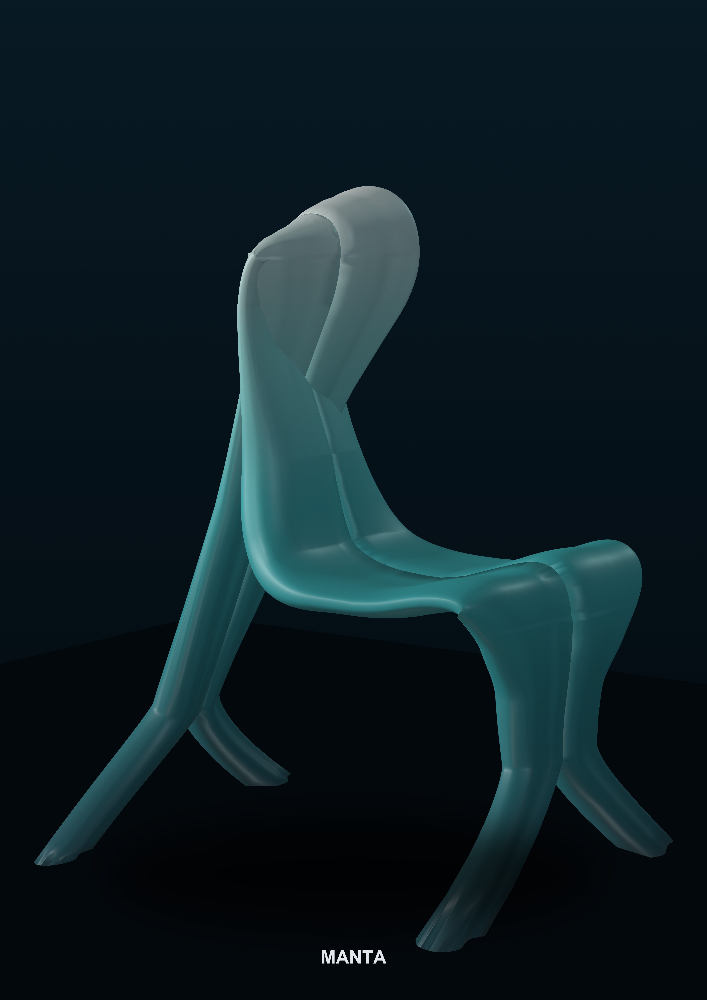

# MANTA — the "one ribbon" chair (Open Chair)



The whole chair is **one continuous ribbon**, **sliced crosswise** (like a
baguette) so every part fits a home printer and every joint stays strong.
Named for the manta ray — the forked feet read as fins, the tail-brace as a
fluke — and for the ocean's role as the planet's largest source of oxygen,
which the surface relief carries in its own graded texture, bold at the
floor and calming toward the crown.

No two of its 41 printed segments are identical, on purpose: nothing in
nature repeats, so nothing here does either. Change a few tables in
`manta_ribbon.py` and the same script regenerates a lighter, cheaper, or
differently-sized chair with the same joints — this repo *is* that script.

📄 [Full description (PDF)](TEAMID_Description.pdf) · 🖼 [Board](TEAMID_Board.jpg) · 🖼 [Poster](TEAMID_Poster.jpg)

Shared under **CC BY-NC-SA** — free to study, adapt, and reprint; not for
commercial resale.

---

## Requirements (Python packages)

```
pip install cadquery numpy scipy shapely trimesh matplotlib vtk pypdfium2 reportlab pillow
```

The first 3 are enough for the geometry itself. The rest are for the
renders / board / poster / PDF.

---

## Run order

| # | command | what it does | output |
|---|---|---|---|
| 1 | `python manta_ribbon.py` | **generator** — builds the ribbon, **slices it**, adds tenons + pins, exports the parts and the assembled chair | `MANTA_RIBBON/` |
| 2 | `python manta_apply_template.py` | embeds the chair + numbered parts into the **official, unmodified** `3D_Template.stl` (chair centred in its 800x800mm footprint box, each part in its numbered 220x220x250mm cell) | overwrites `MANTA_RIBBON/MANTA_Chair.stl` + `MANTA_Assembly.stl` |
| 3 | `python manta_strength_check.py` | **strength + stability check** (first-order, pure math) | printed to the console |
| 4 | `python manta_joint_test.py` | **physical joint test** — small pieces to print and glue | `MANTA_TEST/` |
| — | *renders and submission files:* | | |
| 5 | `python manta_render.py` | renders (poster + board views) | `_deliver/` |
| 6 | `python manta_explode.py` | exploded view + parts grid | `_deliver/` |
| 7 | `python manta_pdf.py` | description -> PDF | `TEAMID_Description.pdf` |
| 8 | `python manta_poster.py` | A2 poster | `TEAMID_Poster.jpg` |
| 9 | `python manta_board.py` | A2 board (on the official template) | `TEAMID_Board.jpg` |
| 10 | `python manta_package.py` | packs the submission files + checks total size | `ODOVZDANIE/` |

**Part numbering**: the official `3D_Template.stl` numbers its 49 cells
column-major (1,8,15,22,29,36,43 down column 1; 2,9,16,... down column 2;
etc) — that's fixed, unmodifiable template geometry. The Board's own key
graphic lays its numbers out row-major instead. Both are correct: only the
*number* has to match between the two (part "5" on the Board = part "5" in
the STL's cell "5"), not the box's on-page position.

**Slicing is NOT a separate file** — it lives inside `manta_ribbon.py`, in the
`build()` function: it makes crosswise cuts (by length + curvature, avoiding
the knee and lumbar), a lengthwise L/R cut on wide segments, conical tenons
at every cut, and a dia 10 pin only at the lumbar joints.

---

## Printing the parts

`TEAMID_Assembly.stl` is the **competition submission** format: all 42 parts
placed inside the official `3D_Template.stl` grid, because the brief
requires that. That template geometry is a non-solid reference grid (lines +
text, not a printable object) — a slicer will still try to load it alongside
your parts, which is confusing and pointless for an actual print.

For printing at home, use [`MANTA_RIBBON/`](MANTA_RIBBON) instead: the same
42 parts, no template geometry mixed in. Each file is named
`NN_SEG_xxx.stl`, where `NN` is the part number from the Board's key and the
exploded-view diagram (`01_SEG_00L.stl` = part 1, `42_PIN.stl` = part 42,
and so on) — so the file list itself tells you what to print against the
Board, no cross-referencing needed. `PARTS_LIST.txt` in that folder has the
same numbering plus print notes (e.g. which segments print standing, no
supports needed).

---

## How to tune it

Everything is set in the `PARAMETERS` block at the top of `manta_ribbon.py`:
- `SPINE` — the ribbon's side profile (X = forward, Z = up)
- `W_S` — width along the length · `TH_S` — thickness along the length (follows the bending moment)
- `TWIST_S` — spiral twist of the section
- `SEG_MAX`, `FORK_SPLAY`, `TEN_R`, `PIN_R` ... — slicing and joints

After printing the joint test, note which clearance (`0.08 / 0.12 / 0.16`)
holds best — set it as `TEN_CLR` and regenerate the final STLs.

---

## How the joint holds (so you don't have to worry)

The joint is **not "just a pin."** In order of importance:

1. **The full solid cross-section, glued face-to-face.** Every cut is
   perpendicular to the ribbon's axis, so you're gluing two flat faces of
   solid material against each other — 6,600–17,000 mm² of epoxy per joint.
   This is the main strength. (Margin in the strength check: **15x**.)
2. **A conical tenon (dia 32)** at the centre of the cut — self-centring,
   and it carries the tension side so the joint can't "open up."
3. **A dia 10 pin** — ONLY at the 2 joints beside the lumbar. It's a
   **backup**, not the main joint. Even if the epoxy failed completely, the
   tenon + pin alone still give a **2.2x margin** there.

Epoxy on PETG: **sand the face (P120) and degrease** before gluing — otherwise
the epoxy won't bond well. Leave it clamped to cure for 24 h.

---

## Code files

- `manta_ribbon.py` — generator + slicing + joints + export
- `manta_apply_template.py` — embeds the chair/parts into the official `3D_Template.stl`
- `manta_strength_check.py` — strength + stability
- `manta_ergonomics_check.py` — seat/backrest dimensions vs standard reference ranges
- `manta_joint_test.py` — physical joint test
- `manta_material.py` — filament use + cost from the real STL parts
- the remaining `manta_*.py` files = rendering / submission packaging
- `MANTA_Description_DRAFT.md` — the description text (edit, then run `manta_pdf.py`)
- `_board_base.png` — the rasterised official board template (without instructions)
- `3D_Template.stl` — the official 3D print file template (unmodified, as provided)
- `MANTA_RIBBON/` — the 42 individual part STLs, clean and ready to print (no template geometry) — see "Printing the parts" above
