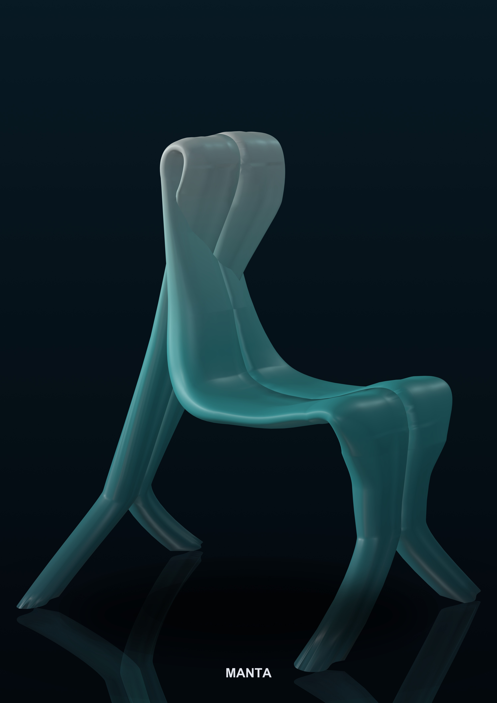

# MANTA — the "one ribbon" chair (Open Chair)



The whole chair is **one continuous ribbon**, **sliced crosswise** (like a
baguette) so every part fits a home printer and every joint stays strong.
Named for the manta ray — the forked feet read as fins, the tail-brace as a
fluke — and for the ocean's role as the planet's largest source of oxygen,
which the surface relief carries in its own graded texture, bold at the
floor and calming toward the crown.

No two of its 41 printed segments are identical, on purpose: nothing in
nature repeats, so nothing here does either. Change a few tables in
`manta_ribbon.py` and the same script regenerates a lighter, cheaper, or
differently-sized chair with the same joints — this repo *is* that script.

📄 [Full description (PDF)](TEAMID_Description.pdf) · 🖼 [Board](TEAMID_Board.jpg) · 🖼 [Poster](TEAMID_Poster.jpg)

Shared under **CC BY-NC-SA** — free to study, adapt, and reprint; not for
commercial resale.

---

## Requirements (Python packages)

```
pip install cadquery numpy scipy shapely trimesh matplotlib vtk pypdfium2 reportlab pillow
```

The first 3 are enough for the geometry itself. The rest are for the
renders / board / poster / PDF.

---

## Run order

| # | command | what it does | output |
|---|---|---|---|
| 1 | `python manta_ribbon.py` | **generator** — builds the ribbon, **slices it**, adds tenons + pins, exports the parts and the assembled chair | `MANTA_RIBBON/` |
| 1b | `python manta_print_ready.py manta_ribbon MANTA_RIBBON _print_ready_competition` | **print files**: generator -> least-support orientation that fits the bed (`manta_orient.py`, writes `ORIENT.json`) -> generator again, pin holes turned into teardrops pointing up for exactly those orientations -> same orientations applied | numbered, pre-rotated STLs |
| 1c | `python manta_slicer_check.py <folder>` | slices every part in **PrusaSlicer** (your own profile) and reports the support it really generates, and whether any of it is inside a hole | `SLICER_REPORT.txt` |
| 2 | `python manta_apply_template.py` | embeds the chair + numbered parts into the **official, unmodified** `3D_Template.stl` (chair centred in its 800x800mm footprint box, each part in its numbered 220x220x250mm cell) | overwrites `MANTA_RIBBON/MANTA_Chair.stl` + `MANTA_Assembly.stl` |
| 3 | `python manta_strength_check.py` | **strength + stability check** (first-order, pure math, live from the tables — also run automatically by step 1) | printed to the console |
| 4 | `python manta_ergonomics_check.py` | **ergonomics check** — 8 seat/backrest dimensions vs seating reference ranges | printed to the console |
| 5 | `python manta_uniqueness_check.py` | **uniqueness check** — proves no two segments share volume/area/bbox | printed to the console |
| 6 | `python manta_joint_test.py` | **physical joint test** — small pieces to print and glue | `MANTA_TEST/` |
| — | *renders and submission files:* | | |
| 7 | `python manta_render.py` | renders (poster + board views) | `_deliver/` |
| 8 | `python manta_explode.py` | exploded view + parts grid | `_deliver/` |
| 9 | `python manta_pdf.py` | description -> PDF | `TEAMID_Description.pdf` |
| 10 | `python manta_poster.py` | A2 poster | `TEAMID_Poster.jpg` |
| 11 | `python manta_board.py` | A2 board (on the official template) | `TEAMID_Board.jpg` |
| 12 | `python manta_package.py` | packs the submission files + checks total size | `ODOVZDANIE/` |

**Part numbering**: the official `3D_Template.stl` numbers its 49 cells
column-major (1,8,15,22,29,36,43 down column 1; 2,9,16,... down column 2;
etc) — that's fixed, unmodifiable template geometry. The Board's own key
graphic lays its numbers out row-major instead. Both are correct: only the
*number* has to match between the two (part "5" on the Board = part "5" in
the STL's cell "5"), not the box's on-page position.

**Slicing is NOT a separate file** — it lives inside `manta_ribbon.py`, in the
`build()` function: it makes crosswise cuts (by length + curvature, avoiding
the knee and lumbar), a lengthwise L/R cut on wide segments, conical tenons
at every cut, and a solid dia 11 pin only at the lumbar joints.

---

## Printing the parts

`TEAMID_Assembly.stl` is the **competition submission** format: all 42 parts
placed inside the official `3D_Template.stl` grid, because the brief
requires that. That template geometry is a non-solid reference grid (lines +
text, not a printable object) — a slicer will still try to load it alongside
your parts, which is confusing and pointless for an actual print.

For printing at home, use [`MANTA_RIBBON/`](MANTA_RIBBON) instead: the same
42 parts, no template geometry mixed in. Each file is named
`NN_SEG_xxx.stl`, where `NN` is the part number from the Board's key and the
exploded-view diagram (`01_SEG_00L.stl` = part 1, `42_PIN.stl` = part 42,
and so on) — so the file list itself tells you what to print against the
Board, no cross-referencing needed. `PARTS_LIST.txt` in that folder has the
same numbering.

**Every file in `MANTA_RIBBON/` and `MANTA_LIGHT/` is pre-rotated to the
orientation that needs the least support** — import and print as-is.

Honest numbers, **measured in PrusaSlicer** (`manta_slicer_check.py`
slices every file and reads the G-code back): a curved, fluted ribbon
segment can't always be printed with zero support, but it is **almost
support-free — under 1 % of the filament is support** (competition: 114 g
of 16.8 kg; `MANTA_LIGHT`: 83 g of 9.0 kg), all of it from the build plate,
most parts only a few grams. `manta_orient.py` tries ~400 orientations per
part and keeps the one that fits the Prusa CORE One's 250 x 220 x 270 mm
volume, stands on a solid base (>= 400 mm² footprint) and needs the least
support, with support inside a hole weighted 100x.

**Nothing grows inside the holes**, because each hole is shaped for the
way its part lies (`manta_teardrop.py`): a socket lying sideways gets a
teardrop roof pointing up, a socket end facing up is pointed (every
surface >= 60°), and the pin holes have no blind end at all — past the
pin's stop they narrow into a channel that runs out through the centre
seam. The one exception PrusaSlicer still shows is a ~0.3 g thin branch up
the pin channel of part 14; the channel is open at both ends, push it out
with a rod. `PARTS_LIST.txt` and `SLICER_REPORT.txt` in each folder list
the support per part.

In the slicer use **"Support on build plate only"** with an overhang
threshold of 45° or lower, never "Everywhere". (Earlier versions of these
docs claimed "no supports", then "29 of 42 parts need none"; neither was
checked in a real slicer, and the 45° socket points of that version still
got support inside them at a 45° threshold.)

---

## How to tune it

Everything is set in the `PARAMETERS` block at the top of `manta_ribbon.py`:
- `SPINE` — the ribbon's side profile (X = forward, Z = up)
- `W_S` — width along the length · `TH_S` — thickness along the length (follows the bending moment)
- `TWIST_S` — spiral twist of the section
- `SEG_MAX`, `FORK_SPLAY`, `TEN_R`, `PIN_R` ... — slicing and joints

`TEN_CLR = 0.12` mm was confirmed on a printed test joint (the cone slides
in with a little play; with the pin and no glue it already held hard).
Printers differ: print `MANTA_TEST/` (~2 h) first on yours, and if the
cone is too tight or too loose change `TEN_CLR` by 0.03 and regenerate.
The print STLs are exported at 0.03 mm tolerance so that this clearance
survives the export (`python manta_stl_fit_check.py` measures it).

**Every run of `manta_ribbon.py` re-checks itself.** Before exporting
anything, it calls `manta_strength_check.py`'s `worst_margin()`, which
re-derives the seat/lumbar/cut/leg section properties live from whatever
`W_S`/`TH_S` are currently set to (not a hand-copied snapshot) and runs the
same load case as the printed report. If tuning the tables has pushed the
weakest joint below the intended safety factor, generation stops with an
error instead of quietly writing an unsafe STL. Run
`python manta_strength_check.py` on its own any time for the full
13-check breakdown.

**A ready-made lighter variant — [`MANTA_LIGHT/`](MANTA_LIGHT).** Not
everyone needs a chair rated for a 120 kg dynamic sitter. `manta_ribbon_personal.py`
is the exact same generator with `TH_S` thinned to 75%, printed with 15%
gyroid and 4 perimeters; `manta_strength_check_personal.py` re-verifies it
for a **70 kg** sitter (x 1.8 dynamic x 2.0 safety): weakest glued check
**1.6x**, glued full-section joint **26x**. The PETG-only backup (peg + pin,
no epoxy) is **0.5x**, so this variant relies on the epoxy actually being
applied. With 15% infill the glue faces are only as good as their solid
skin: use at least 6 top / 5 bottom solid layers and only scuff them with
P120, don't sand through. Pins still at 100% infill. `MANTA_LIGHT/` is the
already-generated, numbered result: same 42 parts, same joints, about half
the filament (**9.0 kg vs 16.8 kg** in PrusaSlicer, ~160 h vs ~470 h; `manta_material_personal.py` for the
cost at your own filament price). Load-test it before sitting on it
(30 -> 50 -> 70 kg, each overnight). A demonstration variant, not the
competition entry — the competition files are untouched.

Want to print it in more than one colour? `python manta_colour_guide.py`
buckets the 41 segments into 4 filament colours by height (floor -> crown),
matching the same gradient the renders already use — prints exactly which
part numbers go in which colour and how many kg/EUR of each. Multi-colour
costs nothing extra: it's the same total filament, just split across spools.

---

## How the joint holds (so you don't have to worry)

The joint is **not "just a pin."** In order of importance:

1. **The full solid cross-section, glued face-to-face.** Every cut is
   perpendicular to the ribbon's axis, so you're gluing two flat faces of
   solid material against each other — 6,600–17,000 mm² of epoxy per joint.
   This is the main strength. (Margin in the strength check: **~26x**; the
   epoxy on the peg **3.5x**, counting only 80 % of its side because a
   sideways socket has a teardrop roof; weakest glued check **2.1x** — see
   `manta_strength_check.py`.)
2. **A conical peg (dia 27 at the face, 22 mm long)** at the centre of the
   cut — self-centring, it aligns the joint and carries shear. Only 3 mm of
   it is fused into its own part; the rest sits in the neighbour's socket
   (0.6 mm deeper than the peg, so the glue faces meet, not the tip; the
   socket's pointed end stays empty and takes the surplus glue and air).
3. **Dia 11 x 133 mm pins, printed SOLID (100% infill) and lying on
   their 2.2 mm flat** (so the layers run along the pin) — ONLY at the 2
   joints beside the lumbar, two per joint. One straight line per joint runs
   through both halves' pegs; from each side face a hole runs in along it,
   narrows in a long taper (the pin's stop) and continues as a dia 7 channel
   out through the centre seam — no blind end, so nothing inside it needs
   support. Slide each pin in until it stops. No pin sticks out; in three
   holes it ends 1 mm below the surface, in one ~27 mm below (the peg there
   sits deeper) — fill that mouth with epoxy. A cone in a cone slides straight out, so without glue
   the pin is the only thing holding it: the backup is peg root -> peg ->
   pin in *series*, and its capacity is the weakest of those. With the pin
   placed close to the face it comes to **0.9x** of the full design load
   (governed by the peg tearing out behind the pin) — a real limp-home
   backup, not a second main joint. An earlier version of the check *added*
   the peg and pin strengths together and reported 1.6x; that was wrong.

`python manta_joint_check.py` rebuilds every part and virtually assembles
the chair: every peg must land in its neighbour's socket, no peg end may
stick out of its own part, every socket must be closed inside ONE part
with at least 2 mm of wall around it, pins may only sit in holes, and no
two neighbouring parts may overlap. Where a whole piece meets a split L/R
pair (and vice versa) the whole piece carries two pegs, one per half, so no
socket is split across the seam. Every joint gets a peg in both variants;
where the part is thin the generator shortens the peg rather than leave less
than 2 mm of wall (it lists those in its report).

**Assembly order matters:** glue each L+R pair of a segment together
FIRST (their seam peg runs sideways, along that segment's own twisted
width direction), and only then join the segments crosswise (all crosswise
pegs of a joint are parallel, so a finished segment slides straight on).
The other way round cannot be assembled. Each part's number is engraved on
one of its glue faces (hidden once glued).

Epoxy on PETG: **sand the face (P120) and degrease** before gluing — otherwise
the epoxy won't bond well. Leave it clamped to cure for 24 h.

---

## Code files

- `manta_ribbon.py` — generator + slicing + joints + export
- `manta_apply_template.py` — embeds the chair/parts into the official `3D_Template.stl`
- `manta_strength_check.py` — strength + stability
- `manta_ergonomics_check.py` — seat/backrest dimensions vs standard reference ranges
- `manta_stl_fit_check.py` — measures the peg/socket clearance left in the exported print STLs
- `manta_joint_check.py` — virtual assembly: every peg seats in its neighbour, nothing sticks out or overlaps
- `manta_uniqueness_check.py` — proves no two of the 41 segments are geometrically identical
- `manta_orient.py` — rotates each part to the orientation needing the least support that fits the bed (solid base kept); writes `ORIENT.json`
- `manta_teardrop.py` — shapes sockets and pin holes for that orientation (teardrop roofs, pointed ends, pin channels) so nothing inside them needs support
- `manta_print_ready.py` — runs generator -> orient -> generator -> orient in the right order for one variant
- `manta_slicer_check.py` — slices every part in PrusaSlicer and reports the support it really adds (and any inside a hole), filament and print time
- `manta_print_list.py` — writes the numbered `PARTS_LIST.txt` with the slicer's per-part support
- `manta_joint_test.py` — physical joint test
- `manta_material.py` — filament use + cost from the real STL parts
- the remaining `manta_*.py` files = rendering / submission packaging
- `MANTA_Description_DRAFT.md` — the description text (edit, then run `manta_pdf.py`)
- `_board_base.png` — the rasterised official board template (without instructions)
- `3D_Template.stl` — the official 3D print file template (unmodified, as provided)
- `MANTA_RIBBON/` — the 42 individual part STLs, clean and ready to print (no template geometry) — see "Printing the parts" above
